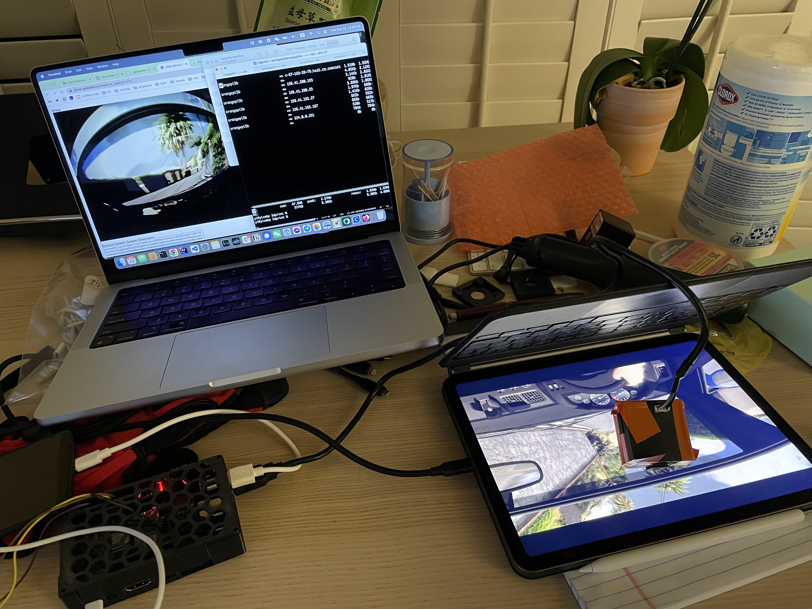
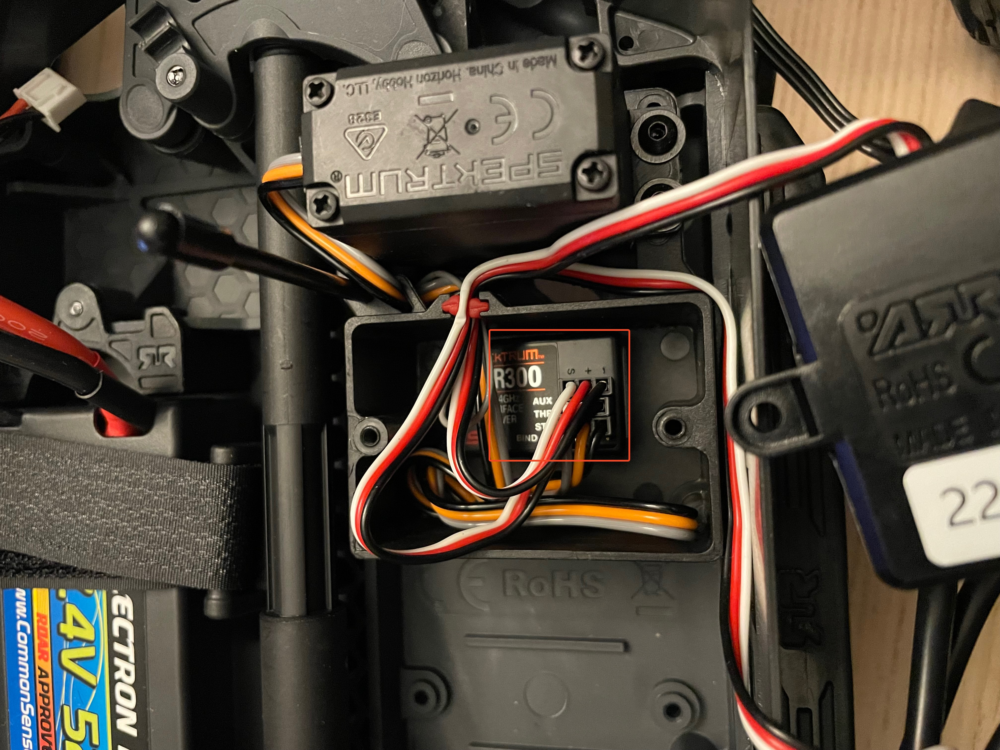

# How to build a cellular controlled RC car

## Equipment needed

### On the car

1. RC car with LiPO battery and charger

2. Controller - [Orange pi 5B](http://www.orangepi.org/html/hardWare/computerAndMicrocontrollers/details/Orange-Pi-5B.html) (abbr OP)
For developement OP 5B is easier as it has wifi built in.
For real production, [OP 5](http://www.orangepi.org/html/hardWare/computerAndMicrocontrollers/details/Orange-Pi-5.html) or other models should be considiered since we want built in 4G/5G connection via the mini PCIE interface

3. Orange pi 5 case to protect the chip. Can be found at `3dprint/` directory, or buy oneline.


4. A cellphone for cellular hotspot (via USB or wifi), so the controller <-> cellphone (hotpot) <-> internet.

5. Power bank that can output 20W at least for OP 5B. [example](https://www.temu.com/goods.html?_bg_fs=1&goods_id=601099512278136&_x_sessn_id=j56h961ikq&refer_page_name=bgt_order_detail&refer_page_id=10045_1685075054588_4uojfkkf21&refer_page_sn=10045). This can also be replaced by a DC - DC converter that takes LiPo battery power to 5V USB power, but I found using vanilla USB is easer to manage.

6. Front camera - wide angle >= 150 degree. [example](https://www.amazon.com/gp/product/B00LQ854AG/ref=ppx_yo_dt_b_asin_title_o03_s00?ie=UTF8&psc=1)

7. [optional] Rear camera - more flexible.

8. [optional] Head lights for night driving.

9. Camera mount, or duct tape.

10. [Wires](https://www.temu.com/goods.html?_bg_fs=1&goods_id=601099514448390&_x_sessn_id=j56h961ikq&refer_page_name=bgt_order_detail&refer_page_id=10045_1685075154373_piumtvf3oc&refer_page_sn=10045) and [breadboard](https://www.temu.com/goods.html?_bg_fs=1&goods_id=601099513843063&_x_sessn_id=j56h961ikq&refer_page_name=bgt_order_detail&refer_page_id=10045_1685075106510_x0iertirp6&refer_page_sn=10045)

### Off the car

1. Multi-meter

2. [optional] Oscilloscope to measure PMW

3. Handle tools to drill holes & file surfaces.

## Hardware wiring changes

### The built in radio controller should have 3 sockets

* STR (steering) 
* THR (throttle)
* AUX (auxiliary things, in this it's for ESC and Motor fan. There may be none for lower end vehicles)



Each socket has 3 wires
* Red for Vcc
* Black for ground
* The other for signal

Power (6V) comes in from ESC. ESC will convert the variable battery voltage to 6V.

The end goal is to replace the steering and throttle signals with the signals generated by OP's GPIO module.

Per OP's manual - https://drive.google.com/drive/folders/1Bre2q0bGgXQuQlYaYDMvwstpvtHLmcgX, PIN 16 and 18 are PWMs we can use.

The final circuit is to connect the 4 groups:

* GND - OP PIN 6, THR GND, STR GND, ESC(Power In) GND
* PWR - THR PWR, STW PWR, ESC PWR
* STR SIGNAL - OP PIN 16
* THROTTLE SIGNAL - OP PIN 18

## Software

1. Bootstrap OP - follow https://www.youtube.com/watch?v=cBqV4QWj0lE for the basic setup. No need for the fancy m2 ssd drive stuff.
2. Install all the packages in [deb_pkg_list.txt](deb_pkg_list.txt)
3. Install go https://go.dev/doc/install
4. Check out this repo.
```
go run wrtc_serve -work dev
```
Visit `http://<OP's IP>:8081` to see the video

USE `W` `A` `S` `D` for direction, or you can connect your game controller as well. The left joystick is for throttle, and the right one is for steering.
